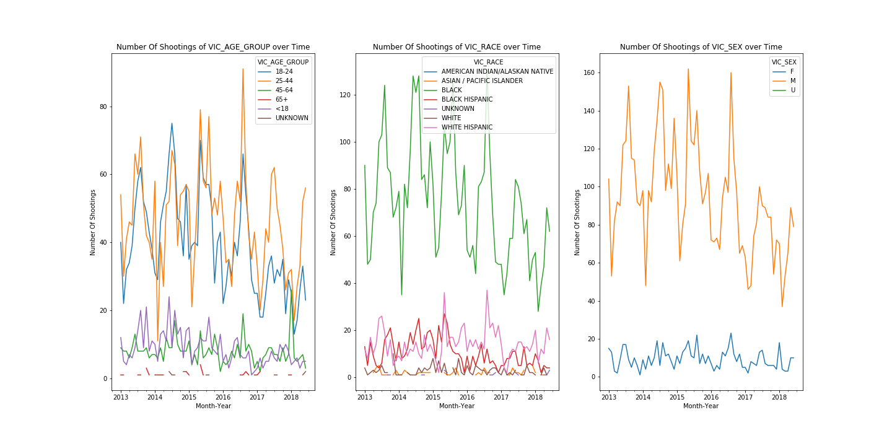

# Explore Bias in the NYC Shooting Incidents Dataset by NYPD

Unless otherwise specified, any materials in this repository are released under the [MIT License](LICENSE).

Prepared by Toan Luong on December 7, 2018 as part of [UW DT512: Human Centered Data Science](https://wiki.communitydata.cc/Human_Centered_Data_Science_(Fall_2018)) Final Project.

The final presentation can be accessed [here](https://docs.google.com/presentation/d/1o8bpG7bKM39mIKT7Bqs3y2OxteckX2bFJzlrVBQVIwM/edit?usp=sharing)

Abstract
---
**Full code and analysis are in the [Notebook](final-project.ipynb)**

Over the course of its history, the New York Police Department (NYPD) has been accused over "the veracity of its tally of shootings and murders". According a [NYTimes article](https://www.nytimes.com/2015/12/30/nyregion/bratton-rebukes-kelly-for-questioning-new-york-crime-data-shame-on-him.html) published in December 2015, the former NYPD Police Commissioner Raymond W. Kelly criticized the NYPD for "manipulating the statistics to make it appear that New York is safer than it actually is". One thing I learn from the [DT512 Lecture on Data Bias](https://wiki.communitydata.cc/upload/7/76/HCDS_2018_week_4_slides.pdf), as ethical data scientists, we should be cautious about potential biases in the dataset, whether they are related to its publishing agency, data collection techniques, or filtering protocols. By identifying these biases, a data scientist can avoid analysis pitfalls that confirm harmful social stereotypes or be used by government agencies to justify heavy policing or gentrification policies against perceived dangerous neighborhoods.

In this project, I explore the primary sources of data reporting biases with regards to the [NYC Shooting Incident dataset](https://data.cityofnewyork.us/Public-Safety/NYPD-Shooting-Incident-Data-Historic-/833y-fsy8) published byt [NYC Open Data](https://opendata.cityofnewyork.us/). Based on the frequency plots spanning several years, the dataset reports a significantly higher number of shootings for Black, 18-24 years old, Male demographics (both perpetrators and victims), compared to that of other demographic groups. Such trend persists from 2013 to 2018 except a slight dip toward the recent year. With regards to where the shooting incidents took place, there exists a frequency skew toward lower-income boroughs in New York city such as Bronx and Brooklyn. Although difficult to avoid, these biases can be analysis pitfalls that journalists and government agencies might base upon to increase NYPD policing toward certain minorities or introduce discriminative policies toward certain perceived dangerous neighborhoods. When analyzing for missing values, I discover the same trend of a large number of Black and Black Hispanic victims, with more than 400 deaths, still have their perpetrators' information missing until year to date. This can be a warning sign for NYPD to revisit their treatment of assault cases of minorities, not just shooting incidents.

My recommendation is that data scientists should be cautious about performing crime-related analyses solely on NYPD data. By cross-checking with other independent data sources or performing side-by-side comparison with similar statistics from other cities, the analyses can be more reliable and population sampling or data reporting bias from the different police departments can be mitigated. The last part of my analysis offers an interactive visualization map of all the shooting incidents in NYC for that year. Ideally, it can be a starting point for other researchers to include other crime-related statistics on NYC or other regions, so that the public can benefit from a fuller and less subjective evaluation of their neighborhood's safety.

Human-Centered Design Considerations
---
I would like to acknowledge several personal biases that might interfere with the formation of my research questions, treatment of the NYC Shooting Incident dataset, and subsequent data explorations. Given the places that I have resided and limited time in the U.S., I have never encountered any shooting or other life-threatening crimes. Such gives me a limited understanding of the responsibilities, risks, legal considerations, and other factors that determine how NYPD and police departments are supposed to treat shooting incidents. As such, any speculations about NYPD operations or behaviors in this analysis should not be treated as factual. Any statistical results from the NYC Open Data dataset are only applied to New York City. Such results are not representative of the United States population and their relationships with law enforcement forces. News outlets and political organizations should not extrapolate these results to their own states and cities.

Usage Instructions
---
This analysis is intended to be fully reproducible. Before running the following [Notebook](final-project.ipynb) cells, please ensure

1. Clone the repository at https://github.com/lmtoan/dt512-final-project.git
2. All the necessary data, already in the `/data` directory, are **extracted on 12/6/2018**. However, to use the most up-to-date data, please clear the folder and download [NYPD Shooting Incident Data *(Historic)*](https://data.cityofnewyork.us/Public-Safety/NYPD-Shooting-Incident-Data-Historic-/833y-fsy8) and [NYPD Shooting Incident Data *(Year To Date)*](https://data.cityofnewyork.us/Public-Safety/NYPD-Shooting-Incident-Data-Year-To-Date-/5ucz-vwe8). Ensure that they are transferred to `/data` directory and named `NYPD_Shooting_Incident_Data__Historic_.csv` and `NYPD_Shooting_Incident_Data__Year_To_Date_.csv`
3. Ensure that the following software dependencies. Most come with the standard data science package offered by [Anaconda](https://www.anaconda.com/download/#macos):
    - Python 3.6
    - Pandas
    - Numpy
    - Matplotlib
    - Folium (can be installed by `pip install folium`)

Data
---
### Data Description

I will be using a combination of historic and year-to-date data that capture every shooting incident occured in New York City from 2013 to 2018. Their links are referenced below:
- [NYPD Shooting Incident Data *(Historic)*](https://data.cityofnewyork.us/Public-Safety/NYPD-Shooting-Incident-Data-Historic-/833y-fsy8). Created on June 5, 2018. Last updated on November 8, 2018.
- [NYPD Shooting Incident Data *(Year To Date)*](https://data.cityofnewyork.us/Public-Safety/NYPD-Shooting-Incident-Data-Year-To-Date-/5ucz-vwe8). Created on June 5, 2018. Last updated on November 8, 2018.
- These datasets share the same [data footnote](https://data.cityofnewyork.us/api/views/833y-fsy8/files/e4e3d86c-348f-4a16-a17f-19480c089429?download=true&filename=NYPD_Shootings_Incident_Level_Data_Footnotes.pdf) which details variables creation methods, exceptions, filtering guidelines, and addresses any data abnormalies and inconsistencies.

Reviewed by Office of Management Analysis and Planning and provided by New York Police Department, the data provide a comprehensive view about "the shooting event, the location and time of occurrence, and information related to suspect and victim demographics". For the *Historic* dataset, there are 6,407 rows and 18 columns. For the *Year-to-date* dataset, there are 441 rows of similar 18 columns. These datasets are viewed more than 460 times and downloaded 75 times.

Several limitations and potential biases are discussed in the following sections.

### License & Terms of Use

The datasets are hosted on [NYC Open Data](https://opendata.cityofnewyork.us/), collected, and maintained by the New York City government. The following excerpt is from their [About](http://www.nyc.gov/html/data/about.html) page, which demonstrates the agencies' commitment to "ensure transparency and foster civic innovation within the City". The NYC Open Data initiative aims to "improve the quality of life" for all its residents. 

> NYC Open Data makes the wealth of public data generated by various New York City agencies and other City organizations available for public use. As part of an initiative to improve the accessibility, transparency, and accountability of City government, this catalog offers access to a repository of government-produced, machine-readable data sets. 

> Anyone can use these data sets to participate in and improve government by conducting research and analysis or creating applications, thereby gaining a better understanding of the services provided by City agencies and improving the lives of citizens and the way in which government serves them.

The rights to use the data for public research are mentioned in the umbrella [Terms of Use](https://opendata.cityofnewyork.us/overview/#termsofuse) and quoted below. There are no disclaimers or copyright exceptions to these datasets.

> By accessing datasets and feeds available through NYC Open Data, the user agrees to all of the [Terms of Use](http://www1.nyc.gov/home/terms-of-use.page) of NYC.gov as well as the [Privacy Policy](http://www1.nyc.gov/home/privacy-policy.page)  for NYC.gov. The user also agrees to any additional terms of use defined by the agencies, bureaus, and offices providing data. Public data sets made available on NYC Open Data are provided for informational  purposes. The City does not warranty the completeness, accuracy,  content, or fitness for any particular purpose or use of any public data  set made available on NYC Open Data, nor are any such warranties to be implied or inferred with respect to the public data sets furnished  therein.
>
> The City is not liable for any deficiencies in the completeness,  accuracy, content, or fitness for any particular purpose or use of any  public data set, or application utilizing such data set, provided by any third party.
>
> Submitting City Agencies are the authoritative source of data  available on NYC Open Data. These entities are responsible for data  quality and retain version control of data sets and feeds accessed on the Site. Data may be updated, corrected, or refreshed at any time.

### Limitations & Biases

As stated in the dataset headers, the NYPD shooting incident data "is manually extracted every quarter and reviewed by the Office of Management Analysis and Planning before being posted on the NYPD website". Such scrutiny might result in excessive filtering of shooting incidents or metadata related to such incidents. Below is a quote from the data footnote that indicates the exclusion of non-injured shooting incidents. Omitting a number of gun-assault related incidents might under-estimate the veracity of NYPD statistics and undermine claims about NYC's safety.

> Only valid shooting incidents resulting in an injured victim are included in this release. Shooting incidents not resulting in an injured victim are classified according to the appropriate offense according to NYS Penal Law. 

There is no description of data de-identification process to protect individuals' privacies. Below is a one-line instruction quoted from the data footnote, which should have been a standardized process given GDPR regulations.

> Any attempt to match the approximate location of the incident to an exact address or link to other datasets is not recommended.

### Schema

| Column Name             | Column Description                                                                                                                                                                    | Type       |
|-------------------------|---------------------------------------------------------------------------------------------------------------------------------------------------------------------------------------|------------|
| INCIDENT_KEY            | Randomly generated persistent ID for each incident                                                                                                                                    | Plain Text |
| OCCUR_DATE              | Exact date of the shooting incident                                                                                                                                                   | Date Time  |
| OCCUR_TIME              | Exact time of the shooting incident                                                                                                                                                   | Plain Text |
| BORO                    | Borough where the shooting incident occurred                                                                                                                                          | Plain Text |
| PRECINCT                | Precinct where the shooting incident occurred                                                                                                                                         | Number     |
| JURISDICTION_CODE       | Jurisdiction where the shooting incident occurred. Jurisdiction codes 0 (Patrol), 1 (Transit) and 2 (Housing) represent NYPD whilst codes 3 and more represent non NYPD jurisdictions | Number     |
| LOCATION_DESC           | Location of the shooting incident                                                                                                                                                     | Plain Text |
| STATISTICAL_MURDER_FLAG | Shooting resulted in the victim’s death which would be counted as a murder                                                                                                            | Check Box  |
| PERP_AGE_GROUP          | Perpetrator’s age within a category                                                                                                                                                   | Plain Text |
| PERP_SEX                | Perpetrator’s sex description                                                                                                                                                         | Plain Text |
| PERP_RACE               | Perpetrator’s race description                                                                                                                                                        | Plain Text |
| VIC_AGE_GROUP           | Victim’s age within a category                                                                                                                                                        | Plain Text |
| VIC_SEX                 | Victim’s sex description                                                                                                                                                              | Plain Text |
| VIC_RACE                | Victim’s race description                                                                                                                                                             | Plain Text |
| X_COORD_CD              | Midblock X-coordinate for New York State Plane Coordinate System, Long Island Zone, NAD 83, units feet (FIPS 3104)                                                                    | Number     |
| Y_COORD_CD              | Midblock Y-coordinate for New York State Plane Coordinate System, Long Island Zone, NAD 83, units feet (FIPS 3104)                                                                    | Number     |

Deliverables
---
Please refer to [Notebook](final-project.ipynb) for full interpretations. Below are the types of plots that can be produced by the notebook.

1. Bias in Statistics

2. Bias in Missing Values

3. Bias in Geographical Distribution

[2014 Interactive Map Visualization ](viz14.html) vs. [2018 Interactive Map Visualization ](viz18.html)

References
---
Data source: https://opendata.cityofnewyork.us/

Footnotes:
1. https://www1.nyc.gov/site/nypd/stats/crime-statistics/crime-statistics-landing.page
2. https://www.nytimes.com/2017/12/27/nyregion/new-york-city-crime-2017.html
3. https://www.nytimes.com/2015/12/30/nyregion/bratton-rebukes-kelly-for-questioning-new-york-crime-data-shame-on-him.html
4. https://en.wikipedia.org/wiki/New_York_City_Police_Department_corruption_and_misconduct
5. https://en.wikipedia.org/wiki/Demographics_of_New_York_City

The project structure is inspired from the following repositories:
- https://wiki.communitydata.cc/upload/7/76/HCDS_2018_week_4_slides.pdf
- https://github.com/rexthompson/DATA-512-Final-Project
- https://github.com/orbitse/data-512-finalproject
